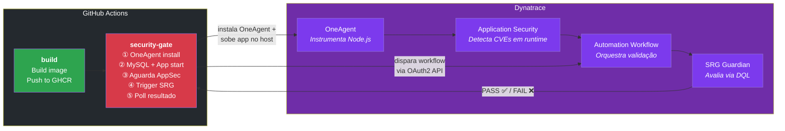
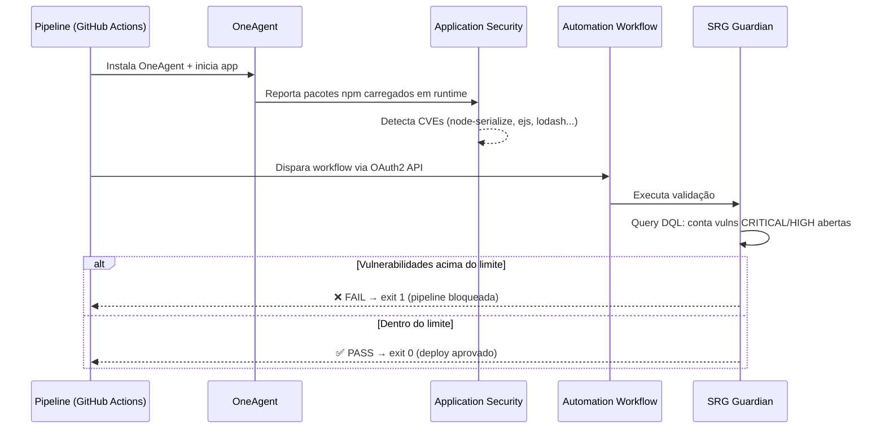

# SRG Vulnerable App

> **⚠️ Aplicação intencionalmente vulnerável — apenas para demonstração.**

App Node.js com vulnerabilidades propositais que demonstra o **Dynatrace Site Reliability Guardian (SRG)** como **security gate no CI/CD** — bloqueando deploys automaticamente quando o Application Security detecta CVEs em runtime.

---

## Arquitetura



**Pontos-chave:**
- **100 % cloud** — roda em `ubuntu-latest`, sem servidor fixo
- **Node.js no host** (não em container) para o OneAgent instrumentar o processo e detectar CVEs via Runtime Vulnerability Detection
- **VM efêmera** — descartada quando o pipeline termina

---

## Exemplo de vulnerabilidade: SQL Injection

A principal vulnerabilidade de código deste projeto é o **SQL Injection** no endpoint `/login`. O input do usuário é concatenado diretamente na query SQL, sem qualquer sanitização:

```js
// ❌ VULNERÁVEL — server.js, endpoint POST /login
const query = `SELECT * FROM users WHERE username='${username}' AND password='${password}'`;
db.query(query, (err, results) => { /* ... */ });
```

Um atacante pode enviar como username:

```
' OR '1'='1' --
```

Isso transforma a query em:

```sql
SELECT * FROM users WHERE username='' OR '1'='1' --' AND password='qualquer'
```

A condição `'1'='1'` é sempre verdadeira e o `--` comenta o resto — o atacante faz login como o primeiro usuário do banco (admin) **sem saber a senha**.

### Como seria o código seguro

```js
// ✅ SEGURO — usando prepared statements (parameterized queries)
const query = 'SELECT * FROM users WHERE username = ? AND password = ?';
db.query(query, [username, password], (err, results) => { /* ... */ });
```

Com prepared statements, o banco trata o input como **dado**, nunca como **código SQL**.

> O Dynatrace Application Security detecta os **pacotes npm vulneráveis** (não o código-fonte em si) em runtime via OneAgent. O SRG Guardian então bloqueia o pipeline automaticamente.

---

## Vulnerabilidades incluídas

### Pacotes npm com CVEs (detectados pelo OneAgent)

| Pacote | Versão | CVE | Severidade |
|--------|--------|-----|------------|
| `node-serialize` | 0.0.4 | CVE-2017-5941 | **CRITICAL** (9.8) — RCE via desserialização |
| `ejs` | 3.1.6 | CVE-2022-29078 | **CRITICAL** (9.8) — Template Injection |
| `lodash` | 4.17.15 | CVE-2020-8203 | **HIGH** (7.4) — Prototype Pollution |
| `axios` | 0.21.1 | CVE-2021-3749 | **HIGH** (7.5) — ReDoS / SSRF |
| `jsonwebtoken` | 8.5.1 | CVE-2022-23529 | **MEDIUM** (6.4) — Buffer Overflow |

### Vulnerabilidades no código

| Tipo | Endpoint | PoC |
|------|----------|-----|
| SQL Injection | `POST /login` | `username: ' OR '1'='1' --` |
| Reflected XSS | `GET /search?q=` | `q=<script>alert(1)</script>` |
| Command Injection | `GET /ping?host=` | `host=localhost; cat /etc/passwd` |
| SSRF | `GET /api/fetch?url=` | `url=http://169.254.169.254/` |
| Path Traversal | `GET /api/file?name=` | `name=../../etc/passwd` |
| Prototype Pollution | `POST /api/merge` | `{"__proto__": {"polluted": true}}` |
| Insecure Deserialization | `POST /api/profile` | payload com `_$$ND_FUNC$$_` |

---

## Como o SRG Security Gate funciona



### Objetivos do Guardian

| Objetivo | Condição de falha |
|----------|-------------------|
| Sem vulnerabilidades CRITICAL | `count > 0` |
| Vulnerabilidades HIGH < 3 | `count > 2` |

---

## Estrutura do projeto

```
├── app/
│   ├── server.js            # App vulnerável (Express)
│   ├── package.json         # Dependências com CVEs
│   ├── views/               # Templates EJS
│   └── data/sample.txt      # Alvo para Path Traversal
├── dynatrace/
│   ├── guardian.json         # Definição do Guardian
│   └── workflow.json         # Template do Workflow
├── scripts/
│   ├── setup_dynatrace.sh   # Cria Guardian + Workflow (executar 1x)
│   ├── trigger_validation.sh # Dispara o Workflow
│   └── check_validation.sh  # Poll do resultado
├── .github/workflows/
│   └── deploy.yml           # Pipeline CI/CD
├── docker-compose.yml       # Stack local (app + mysql)
├── Dockerfile               # Build da imagem
├── init.sql                 # Seed do banco MySQL
└── README.md
```

---

## Setup

### 1. Rodar localmente

```bash
git clone https://github.com/brunoxy01/srg-vulnerable-app.git
cd srg-vulnerable-app
cp .env.example .env
docker compose up -d
```

Acesse http://localhost:3000

### 2. Configurar Dynatrace

Crie um **OAuth2 Client** em [Account Management](https://myaccount.dynatrace.com/iam/oauth-clients) com os scopes:

```
automation:workflows:read, write, run
srg:guardians:read, write
security:findings:read
```

Execute o setup (cria Guardian + Workflow):

```bash
./scripts/setup_dynatrace.sh
```

### 3. Configurar GitHub Secrets

| Secret | Descrição |
|--------|-----------|
| `DOCKER_USERNAME` | Username GitHub |
| `DOCKER_PASSWORD` | PAT com `write:packages` |
| `DT_API_TOKEN` | Token com escopo `InstallerDownload` |
| `DT_CLIENT_ID` | OAuth2 Client ID |
| `DT_CLIENT_SECRET` | OAuth2 Client Secret |
| `DT_WORKFLOW_ID` | ID do Workflow (saída do setup) |

### 4. Push e ver o bloqueio

```bash
git push origin main
# Actions: build ✅ → security-gate ❌ BLOCKED
```

---

## Como corrigir (desbloquear)

Atualize os pacotes em `app/package.json`:

```json
"ejs":            "3.1.10",
"lodash":         "4.17.21",
"axios":          "1.7.9",
"jsonwebtoken":   "9.0.2"
```

Remova `node-serialize` e substitua por `JSON.parse`/`JSON.stringify`.

```bash
git commit -am "fix: upgrade vulnerable dependencies"
git push origin main
# Actions: build ✅ → security-gate ✅ PASSED
```

---

## Troubleshooting

| Sintoma | Solução |
|---------|---------|
| `Authentication failed` | Verifique `DT_CLIENT_ID` / `DT_CLIENT_SECRET` e os scopes do OAuth client |
| Vulnerabilidades não aparecem | OneAgent precisa de ~5 min. Verifique se a app está rodando e endpoints foram acessados |
| Guardian sempre passa | Ative Application Security em Settings → Vulnerability Analytics |
| `invalid_scope` | Recrie o OAuth client com todos os scopes necessários |
